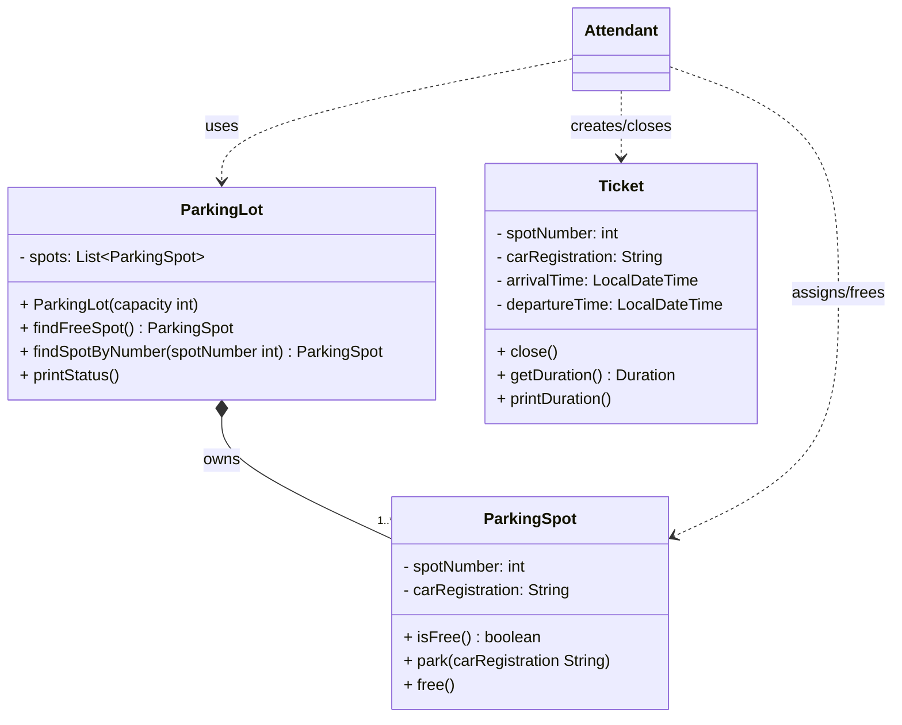

# The Parking Lot

 - This project models a small parking lot in central Stockholm. 
    An attendant assigns arriving cars to free parking spots, creates tickets, closes tickets 
    when cars leave, prints the parked duration, and frees the spot again.

## Features

- Tracks free and occupied parking spots
- Assigns arriving cars to the first free spot
- Creates a ticket with spot number and arrival time
- Closes a ticket when the car leaves
- Prints how long the car was parked
- Handles a full parking lot with a clear message

## Design
- The **ParkingLot** owns a fixed number of **ParkingSpot** objects.
- The **Attendant** does not own the spots. The attendant only uses the parking lot to find a free spot, assign a car, and free the spot when the car leaves.
- The **Ticket** belongs to one parking session. It records the spot number, car registration, arrival time, and departure time.

---

## How To Run

### Build the project:
 - mvn package

### Run the app:
 - java -jar target\OOP-2.TheParkingLot.jar

### Or run directly with Maven:
 - mvn compile exec:java -Dexec.mainClass="se.lexicon.App"